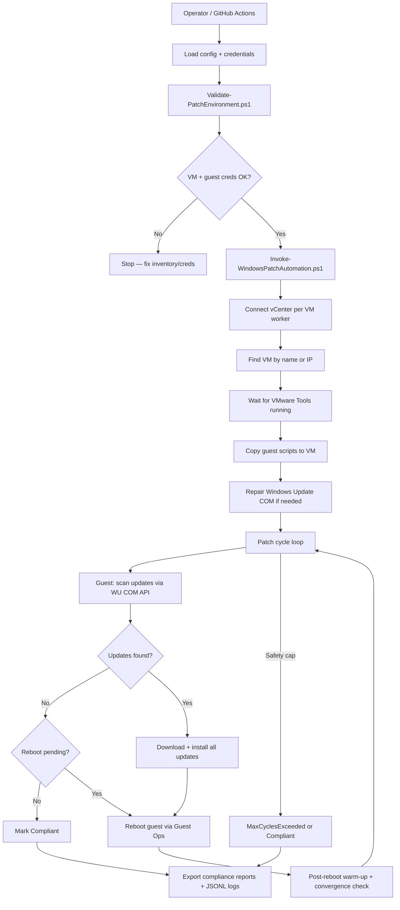

# Windows Patch Automation — Process Flow & Mechanism

**Repository:** Windows-Patch-Automation-Framework  
**Version:** 1.1 (Sep 2026)  
**Audience:** Operators and engineers running or reviewing patch jobs

---

## 1. What this framework does (one paragraph)

This framework patches Windows VMs on VMware vCenter **without RDP, WinRM, or direct network login to the guest**. A Linux/Windows runner connects to **vCenter only** (HTTPS 443). All work inside Windows is done through **VMware Guest Operations** (`Invoke-VMScript`, `Copy-VMGuestFile`). The runner copies PowerShell scripts into each VM, starts them as local Administrator, polls for completion, reboots when required, and repeats until no updates remain—or a safety limit is hit. Every step is logged as structured JSON and exported as compliance reports.

---

## 2. End-to-end flow



### Typical happy path (3 steps)

1. **Validate** — vCenter login works; VM exists; guest `admin`/`Administrator` works via Guest Ops test command.
2. **Patch loop** — One cycle scans, downloads, and installs all pending updates; guest reboots if needed; next cycle finds zero updates → **Compliant**.
3. **Report** — CSV/HTML/JSON compliance report + per-VM logs under `output/<run-id>/`.

---

## 3. Connection mechanism (how the runner talks to Windows)

There are **two completely separate credential pairs**. They must not be mixed up.

| Credential | Used for | Example |
|------------|----------|---------|
| `VCENTER_USERNAME` / `VCENTER_PASSWORD` | Login to vCenter SSO | `ks4@vsphere.local` |
| `WINDOWS_GUEST_USERNAME` / `WINDOWS_GUEST_PASSWORD` | Login **inside** each VM via Guest Ops | `admin` or `Administrator` |

### Network path

```
Runner ──HTTPS 443──► vCenter (blr-vsphere-01.strykercorp.com)
                         │
                         └── VMware Tools ──► Guest OS (Windows)
                              Invoke-VMScript / Copy-VMGuestFile
```

- The runner **never** opens RDP (3389), WinRM (5985), or SMB to the VM IP.
- The guest reaches **WSUS or Microsoft Update** on its own (normal Windows Update path).
- VMware Tools must be **running** (`guestToolsRunning`).

### Key PowerCLI operations

| Operation | Purpose |
|-----------|---------|
| `Connect-VIServer` | Authenticate to vCenter |
| `Get-VM` / IP fallback lookup | Resolve exact VM object |
| `Copy-VMGuestFile -LocalToGuest` | Upload patch scripts to `C:\ProgramData\EnterprisePatchAutomation` |
| `Invoke-VMScript` | Run PowerShell inside the guest as the guest admin account |
| `Copy-VMGuestFile -GuestToLocal` | Download result JSON and logs back to the runner |
| Guest reboot via `Restart-Computer` in Invoke-VMScript | Trigger reboot; wait until Tools go down then up again |

---

## 4. Script reference (one–two line each)

| Script | Role |
|--------|------|
| `execute_repair_and_patch.sh` | Bash wrapper: loads `~/.windows_patch_creds`, runs validation, then starts patching. |
| `execute_patch.sh` | Same as above without the repair-focused default inventory path. |
| `Validate-PatchEnvironment.ps1` | Read-only check: connects vCenter, finds each VM, tests guest credentials with a simple `hostname` command. |
| `Invoke-WindowsPatchAutomation.ps1` | **Main orchestrator**: parallel VM workers, patch cycles, reboots, convergence checks, report export. |
| `Modules/VCenter.GuestOps.psm1` | vCenter connect, VM lookup (name + IP fallback), script staging, cycle polling, reboot, convergence verify. |
| `Modules/Framework.Common.psm1` | Config load/validate, structured JSONL logging, retry helper, compliance report export. |
| `Guest/Invoke-WindowsUpdate.ps1` | **Runs inside Windows**: one scan/download/install cycle using native WU COM API. |
| `Guest/Repair-WindowsUpdateAgent.ps1` | **Runs inside Windows**: fixes broken WU COM (service reset, cache rename, optional DISM/SFC). |
| `Resolve-VMInventory.ps1` | Maps spreadsheet IPs to exact vCenter VM names. |
| `Export-PatchExecutionReport.ps1` | Builds Excel summary from completed run output folders. |
| `configure_and_validate.sh` | Interactive prompt for credentials + full validation. |

---

## 5. Update checking process (inside the guest)

**Script:** `Guest/Invoke-WindowsUpdate.ps1`  
**API:** Windows Update Agent COM (`Microsoft.Update.Session`)

### Steps in one cycle

1. **Warm-up** — If the VM rebooted recently, start `wuauserv`, `bits`, `cryptsvc`, `msiserver` and wait 45–90 seconds.
2. **Open COM session** — `New-Object -ComObject Microsoft.Update.Session` and `Microsoft.Update.SystemInfo`.
3. **Scan (primary)** — Search with criteria from `config/settings.json`:
   ```
   IsInstalled=0 and IsHidden=0
   ```
4. **Scan (definitions)** — Second search for Defender/security intelligence updates:
   ```
   IsInstalled=0 and IsHidden=0 and CategoryIDs contains '798'
   ```
   Results are merged so definition updates are not missed.
5. **Evaluate** — If count = 0 and no real reboot pending → status `NoUpdates` (done). If count = 0 but reboot registry keys exist → status `RebootRequired`.

### Reboot detection (not just COM flag)

The guest checks **registry reboot-pending keys**, not only `SystemInfo.RebootRequired`, to avoid false “reboot required” loops after updates are already installed.

---

## 6. Update installation process (inside the guest)

When applicable updates are found:

1. **Accept EULAs** — `update.AcceptEula()` for each update not yet accepted.
2. **Download** — `CreateUpdateDownloader()` → download all updates in one batch.
3. **Install** — `CreateUpdateInstaller()` → install all downloaded updates in one batch.
4. **Record per-update result** — Each update gets title, KB IDs, result code (`Succeeded` = 2), HRESULT, reboot flag.
5. **Write result file** — Atomic write to `cycle-<N>-result.json` on the guest (runner polls for this file).

If COM fails with `0x800703FA` (registry marked for deletion):

- After reboot: **wait 60s** and retry COM (do not wipe cache immediately).
- If still broken: rename `SoftwareDistribution`, restart services, or return `RebootRequired`.

---

## 7. Orchestrator patch loop (on the runner)

**Script:** `Invoke-WindowsPatchAutomation.ps1`

For each enabled row in `config/vms.csv`:

| Phase | What happens |
|-------|----------------|
| Connect | `Connect-PatchVCenter` with retry/backoff |
| Resolve VM | By `VMName`; if not found, fallback match by `IPAddress` in inventory |
| Tools ready | Poll until `guestToolsRunning` and guest state = `running` |
| Stage scripts | Create guest folder; copy `Invoke-WindowsUpdate.ps1` + `Repair-WindowsUpdateAgent.ps1` |
| Repair | Quick COM test; if broken → basic repair; if still broken → DISM + SFC (`Repair-WindowsUpdateAgent.ps1 -DeepRepair`) |
| **Cycle 1..N** | Start guest patch job async → poll until `cycle-N-result.json` exists → copy artifacts to runner |
| Reboot | If install or scan says reboot needed → `Restart-Computer` via Guest Ops → wait Tools → **90s service warm-up** |
| Convergence | After reboot, `Test-GuestPatchConvergence`: pending count = 0 and no registry reboot pending → **Compliant** |
| Cap | `maxPatchCycles` (default 8) limits install cycles; `maxRebootOnlyCycles` (default 2) limits empty reboot loops |

Workers run in **parallel** up to `throttleLimit` (default 4). Each worker has its own vCenter session.

---

## 8. Result logging mechanism

Logging uses **JSON Lines** (`.jsonl`) — one JSON object per line, easy to grep and merge.

### Log layers

| File | Written by | Contents |
|------|------------|----------|
| `output/<run-id>/master.jsonl` | Orchestrator | Run start/end + merged copy of all VM logs |
| `output/<run-id>/vm-logs/<VM>/orchestrator.jsonl` | Orchestrator | Connect, repair, cycle start/end, reboot, convergence, errors |
| `output/<run-id>/vm-logs/<VM>/cycle-N-guest.jsonl` | Guest patch script | Scan, download, install, remediation steps inside Windows |
| `output/<run-id>/vm-logs/<VM>/cycle-N-result.json` | Guest patch script | Machine-readable cycle summary (counts, updates, status) |
| `output/<run-id>/vm-logs/<VM>/repair-result.json` | Guest repair script | COM status, DISM/SFC exit codes |
| `output/<run-id>/compliance-report.json` | Orchestrator | Final status per VM + full update list |
| `output/<run-id>/compliance-report.csv` | Orchestrator | Summary table for Excel/BI |
| `output/<run-id>/compliance-report.html` | Orchestrator | Human-readable fleet report |

### JSONL entry shape

```json
{
  "timestampUtc": "2026-09-08T11:20:00.3209404Z",
  "level": "Information",
  "stage": "PatchCycle",
  "vmName": "BLR-AARYA-VS",
  "message": "Starting patch cycle 1.",
  "data": {}
}
```

### Final VM status values

| Status | Meaning |
|--------|---------|
| `Compliant` | No pending updates; convergence verified |
| `MaxCyclesExceeded` | Safety cap hit (may still have installed updates) |
| `Failed` | Hard error (COM broken, timeout, auth failure, etc.) |

---

## 9. Configuration files

| File | Purpose |
|------|---------|
| `config/settings.json` | vCenter default, timeouts, max cycles, reboot warm-up, search criteria |
| `config/vms.csv` | VM list; only rows with `Enabled=true` are patched |
| `config/vcenters.json` | BLR / FW / STC vCenter server names |
| `~/.windows_patch_creds` | Local cred export file (not in git): both credential pairs |

---

## 10. How to run locally (what we used on BLR VMs)

```bash
cd Windows-Patch-Automation-Framework
source ~/.windows_patch_creds

# Validate only
pwsh -File ./scripts/Validate-PatchEnvironment.ps1 -InventoryPath ./output/blr-aarya-vs-only.csv

# Validate + patch
./scripts/execute_repair_and_patch.sh ./output/blr-aarya-vs-only.csv

# Watch progress
tail -f output/patch-run-*.log
```

Reports appear under `output/<guid>/` when the run finishes.

---

## 11. What we observed on BLR VMs (Sep 2026)

| VM | Outcome | Mechanism note |
|----|---------|----------------|
| blr-122106 VS | Compliant | Healthy WU COM; 1 update in 1 cycle |
| BLR-AARYA-VS | 8 updates installed | Old code hit reboot-only loop; fixed in commit `28f3551` |
| blr-122105 VMP | Failed | WU COM `0x800703FA`; DISM/SFC could not restore COM |
| BLR-AA-VSTG / BLR-AARIF-VCG | Not started | Guest credential auth failed at validation |

---

## 12. Security summary

- Credentials live in environment variables / GitHub secrets — never in CSV, logs, or reports.
- Guest scripts run as local admin **only** through VMware Guest Operations audit trail in vCenter.
- No inbound management ports required on target VMs beyond existing VMware Tools + Windows Update egress.

---

*For operator steps and manual WU repair, see `docs/Windows-Patch-Automation-Manual.md` and `TROUBLESHOOTING.md`.*

**Website guide:** open [`docs/index.html`](index.html) in a browser for an interactive, shareable version of this document.
